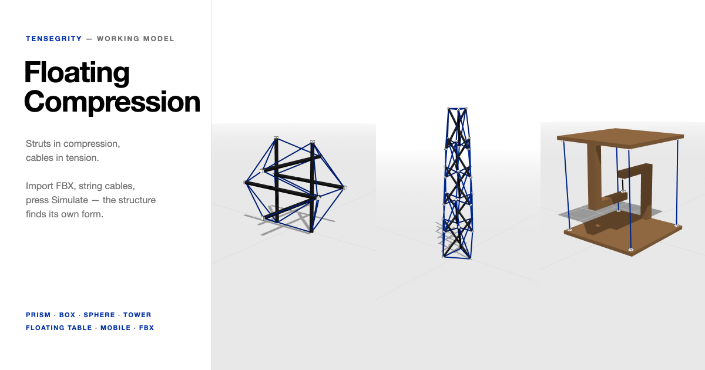

# Floating Compression — a Tensegrity Working Model

**[Open the live model →](https://adpchrgruber.github.io/adp_adv_tensegrity_lab/)**



An interactive workbench for **tensegrity structures** in the tradition of Buckminster
Fuller and Kenneth Snelson: rigid struts in compression, floating in a continuous net
of cables that carry only tension.

Import any 3D object as FBX, place attachment points on its surface, string cables
between them, and press **Simulate** — the structure finds its own form under gravity
and prestress.

## Use

1. **Start from a preset or example** — or build from scratch:
   - **Add objects** — load an FBX file, or use the built-in strut / box. An **anchor**
     is a fixed point in space for hanging structures.
   - **Add points** — click anywhere on an object's surface to place an attachment point.
   - **Add cables** — click two points to connect them. Cables are tension-only: they
     pull when stretched, go slack when not.
2. **Simulate** — gravity, cable stiffness, damping, **prestress** and density are
   tunable live. Slack cables render grey; under load they turn blue, darkening toward
   black as tension rises. **Reset** returns to the editing pose.
3. **Pin** any object in the list to hold it still — also while the simulation runs.
4. **Save scene** downloads the whole setup as JSON (imported FBX files are embedded);
   **Open scene…** loads it back.

Keys: **G** move · **R** rotate · **S** scale · **F** frame all · **Space** simulate /
pause · **Del** remove · **Esc** deselect.

### Presets

| Preset | Struts | Cables | |
|---|---|---|---|
| 3-Strut Prism — Fuller Simplex | 3 | 9 | the minimal tensegrity, 150° twist |
| Box — 4-Strut Square Prism | 4 | 12 | square top and bottom, 135° twist |
| Sphere — 6-Strut Expanded Octahedron | 6 | 24 | three orthogonal strut pairs on an icosahedral net |
| Tower — Stacked Needle Column | 15 | 69 | five overlapping prisms of alternating twist, after Snelson's *Needle Tower* |

### Example scenes (`examples/`)

| Scene | Uses | |
|---|---|---|
| `floating-table.json` | `table-half.fbx` ×2 | the "impossible" floating table: one short kiss cable holds the top up, four perimeter cables hold it down |
| `bow-prism.json` | `curved-strut.fbx` ×3 | the simplex built from bowed struts |
| `plate-mobile.json` | `triangle-plate.fbx`, `curved-strut.fbx`, anchors | plates and a bow hanging from three fixed anchors |
| `hourglass-box.json` | `hourglass-strut.fbx` ×4 | the square prism with turned struts |

The FBX files are plain ASCII FBX 7.4 authored in centimetres, so they also show how
imports are normalised. Load them on their own with **Load FBX…** to build your own.

## Model

- Each object is a rigid body ([cannon-es](https://github.com/pmndrs/cannon-es)); its
  collision shape is its bounding box. Collisions between objects are off by default —
  in a tensegrity the struts don't touch.
- A cable is a tension-only spring-damper applied at its exact attachment points, so
  off-centre attachments produce real torques. Stiffness is axial (EA): force = EA ×
  strain, so short cables are stiffer than long ones.
- **Prestress** sets every cable's rest length as a fraction of its length when you
  press Simulate. Below 1 the net is pre-tensioned; at 1 cables just hang.
- The integration step is chosen from the scene (stiffness, lightest body, smallest
  moment of inertia) so explicit springs stay stable; damping is capped per cable so it
  can't overshoot. The panel shows the step and drops to slow motion if a very stiff
  scene can't keep up with real time.

## Run locally

Single self-contained `index.html` — no build step. Rendering and FBX parsing by
[three.js](https://threejs.org), both libraries loaded from CDN. Opening `index.html`
directly works, but presets-only: the example scenes need the folder served over http:

```bash
python3 -m http.server
```

The example FBX and scene files are generated by `tools/make_examples.py` and
`tools/make_scenes.py` (Python 3, standard library only):

```bash
cd tools && python3 make_examples.py && python3 make_scenes.py
```

## Repository layout

```
index.html        the whole app (HTML, CSS, JS module)
examples/         example FBX models and scene files
tools/            generators for the examples
docs/preview.png  social / README preview image
```

## Scripting

The page exposes `window.tensegrity` in the browser console, e.g.

```js
tensegrity.buildPreset('tower')
tensegrity.simulateFor(3)          // advance 3 s of simulated time synchronously
tensegrity.serializeScene()        // the scene as a JSON-ready object
tensegrity.buildGraph({ nodes, struts, cables })   // your own strut/cable graph
```
